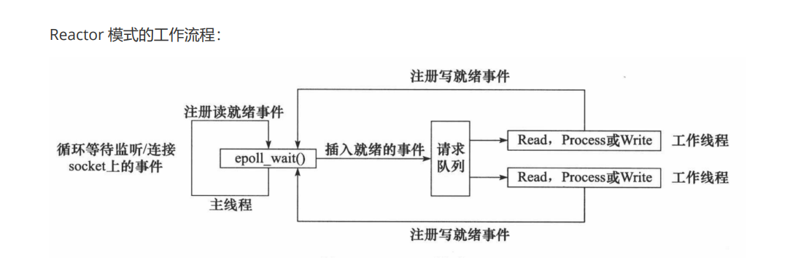
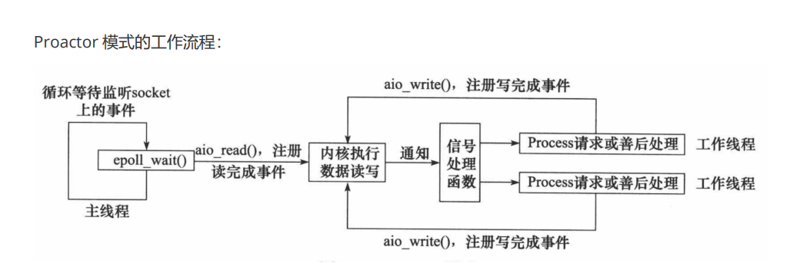
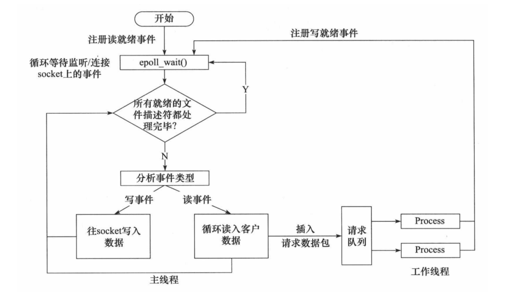

# WebServer
```shell
kevin@k:~/desktop/Server$ g++ *.cpp -pthread

kevin@k:~/desktop/Server$ ./a.out 10000
```
> Stress test: 500 clients to maintain a 5s connection. Tests with a pressure of 1000 clients fail due to non-root users.
```shell
kevin@k:~/desktop/Server$ cd ~/desktop/Server/test_presure/webbench-1.5

kevin@k:~/desktop/Server/test_presure/webbench-1.5$ make

kevin@k:~/desktop/Server/test_presure/webbench-1.5$ ./webbench -c 500 -t 5 http://192.168.0.119:10000/index.html 
Webbench - Simple Web Benchmark 1.5
Copyright (c) Radim Kolar 1997-2004, GPL Open Source Software.

Benchmarking: GET http://192.168.0.119:10000/index.html
500 clients, running 5 sec.

Speed=157956 pages/min, 1139861 bytes/sec.
Requests: 13163 susceed, 0 failed.
```

## Reactor模式
> **要求主线程（I/O处理单元）只负责监听文件描述符上是否有事件发生，有的话就立即将该事件通知工作线程（逻辑单元），将socket可读可写事件放入请求队列，交给工作线程处理。除此之外，主线程不做任何其他实质性的工作。读写数据，接受新的连接，以及处理客户请求均在工作线程中完成。使用同步 I/O（以epoll_wait为例）实现的 Reactor 模式的工作流程是：**
> 1. 主线程往 epoll 内核事件表中注册 socket 上的读就绪事件。
> 2. 主线程调用 epoll_wait 等待 socket 上有数据可读。
> 3. 当 socket 上有数据可读时， epoll_wait 通知主线程。主线程则将 socket 可读事件放入请求队列。
> 4. 睡眠在请求队列上的某个工作线程被唤醒，它从 socket 读取数据，并处理客户请求，然后往 epoll 内核事件表中注册该 socket 上的写就绪事件。
> 5. 当主线程调用 epoll_wait 等待 socket 可写。
> 6. 当 socket 可写时，epoll_wait 通知主线程。主线程将 socket 可写事件放入请求队列。
> 7. 睡眠在请求队列上的某个工作线程被唤醒，它往 socket 上写入服务器处理客户请求的结果。
> 

## Proactor模式
> **Proactor 模式将所有 I/O 操作都交给主线程和内核来处理（进行读、写），工作线程仅仅负责业务逻辑。使用异步 I/O 模型（以 aio_read 和 aio_write 为例）实现的 Proactor 模式的工作流程是：**
> 1. 主线程调用 aio_read 函数向内核注册 socket 上的读完成事件，并告诉内核用户读缓冲区的位置,以及读操作完成时如何通知应用程序（这里以信号为例）。
> 2. 主线程继续处理其他逻辑。
> 3. 当 socket 上的数据被读入用户缓冲区后，内核将向应用程序发送一个信号，以通知应用程序数据已经可用。
> 4. 应用程序预先定义好的信号处理函数选择一个工作线程来处理客户请求。工作线程处理完客户请求后，调用 aio_write 函数向内核注册 socket 上的写完成事件，并告诉内核用户写缓冲区的位置，以及写操作完成时如何通知应用程序。
> 5. 主线程继续处理其他逻辑。
> 6. 当用户缓冲区的数据被写入 socket 之后，内核将向应用程序发送一个信号，以通知应用程序数据已经发送完毕。
> 7. 应用程序预先定义好的信号处理函数选择一个工作线程来做善后处理，比如决定是否关闭 socket。
> 

## 模拟Proactor模式
> **使用同步 I/O 方式模拟出 Proactor 模式。原理是：主线程执行数据读写操作，读写完成之后，主线程向工作线程通知这一“完成事件”。那么从工作线程的角度来看，它们就直接获得了数据读写的结果，接下来要做的只是对读写的结果进行逻辑处理。使用同步 I/O 模型（以 epoll_wait为例）模拟出的 Proactor 模式的工作流程如下：**
> 1. 主线程往 epoll 内核事件表中注册 socket 上的读就绪事件。
> 2. 主线程调用 epoll_wait 等待 socket 上有数据可读。
> 3. 当 socket 上有数据可读时，epoll_wait 通知主线程。主线程从 socket 循环读取数据，直到没有更多数据可读，然后将读取到的数据封装成一个请求对象并插入请求队列。
> 4. 睡眠在请求队列上的某个工作线程被唤醒，它获得请求对象并处理客户请求，然后往 epoll 内核事件表中注册 socket 上的写就绪事件。
> 5. 主线程调用 epoll_wait 等待 socket 可写。
> 6. 当 socket 可写时，epoll_wait 通知主线程。主线程往 socket 上写入服务器处理客户请求的结果。
> 

## EPOLLONESHOT事件
> 1. 即使可以使用ET模式，一个socket上的某个事件还是可能被触发多次。这在并发程序中就会引起一个问题。比如一个线程在读取完某个socket上的数据后开始处理这些数据，而在数据的处理过程中该socket上又有新数据可读 (EPOLLIN再次被触发)，此时另外一个线程被唤醒来读取这些新的数据。于是就出现了两个线程同时操作一个socket的局面，一个socket连接在任一时刻都只被一个线程处理，可以使用epoll的EPOLLONESHOT事件实现。
> 2. 对于注册了EPOLLONESHOT事件的文件描述符，操作系统最多触发其上注册的一个可读、可写或者异常事件，且只触发一次，除非我们使用 epoll_ctl 函数重置该文件描述符上注册的EPOLLONESHOT事件。这样，当一个线程在处理某个socket时，其他线程是不可能有机会操作该socket的。但反过来思考，注册了EPOLLONESHOT事件的socket一旦被某个线程处理完毕，该线程就应该立即重置这个socket上的EPOLLONESHOT事件，以确保这socket下一次可读时，其EPOLLIN事件能被触发，进而让其他工作线程有机会继续处理这个socket。